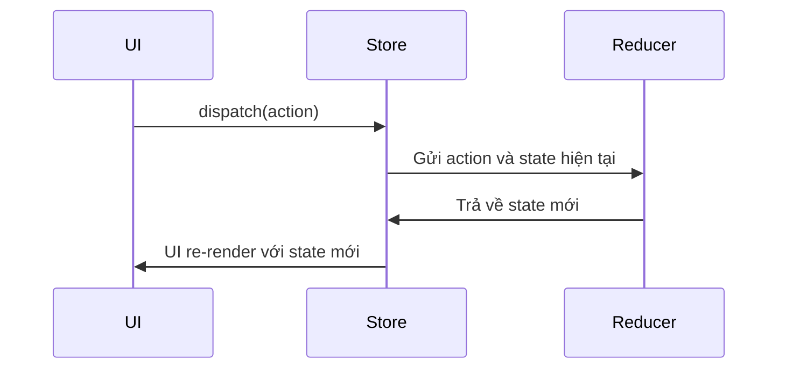

# Redux ToDoApp

<p align="center">
  
  
  
  
  
</p>

---

## 🗂️ Thống Kê Ngôn Ngữ


- **TypeScript:** 96.7%
- **JavaScript:** 2.2%
- **HTML:** 1.1%

---

## 📝 Mô tả

**Redux ToDoApp** là ứng dụng quản lý công việc (ToDo) được xây dựng với React, Redux, TypeScript và Vite. Ứng dụng này giúp bạn học cách quản lý state hiệu quả với Redux, đồng thời áp dụng các công nghệ hiện đại trong phát triển frontend.

---

## 🛠️ Công Nghệ Sử Dụng

-  **Redux** - Quản lý trạng thái ứng dụng.
-  **Vite** - Công cụ build và môi trường phát triển siêu nhanh.
-  **TypeScript** - Ngôn ngữ lập trình bổ sung kiểu tĩnh cho JavaScript.
-  **JavaScript** - Ngôn ngữ lập trình nền tảng web.
-  **HTML5** - Đánh dấu cấu trúc cho ứng dụng.

---

## 🚀 Hướng Dẫn Cài Đặt & Chạy Ứng Dụng

1. **Clone dự án về máy:**
   ```bash
   git clone https://github.com/quangcaptain26-3/Redux-ToDoApp.git
   cd Redux-ToDoApp
   ```

2. **Cài đặt dependencies:**
   ```bash
   # Sử dụng npm
   npm install

   # Hoặc sử dụng yarn
   yarn install

   # Hoặc pnpm
   pnpm install
   ```

3. **Chạy ứng dụng ở mode phát triển (development) với Vite:**
   ```bash
   # Sử dụng npm
   npm run dev

   # Sử dụng yarn
   yarn dev

   # Sử dụng pnpm
   pnpm dev
   ```

4. **Build ứng dụng cho production:**
   ```bash
   # Sử dụng npm
   npm run build

   # Sử dụng yarn
   yarn build

   # Sử dụng pnpm
   pnpm build
   ```

5. **Preview production build:**
   ```bash
   # Sử dụng npm
   npm run preview

   # Sử dụng yarn
   yarn preview

   # Sử dụng pnpm
   pnpm preview
   ```

---

## 📚 Lý Thuyết Về Redux

### Redux là gì?

Redux là thư viện quản lý trạng thái (state management) phổ biến nhất cho các ứng dụng JavaScript lớn, đặc biệt khi sử dụng với React. Redux giúp lưu trữ trạng thái toàn bộ ứng dụng trong một "store" duy nhất, giúp kiểm soát, debug và đồng bộ dữ liệu dễ dàng hơn.

### Ba nguyên lý cốt lõi của Redux

1. **Single Source of Truth**  
   Toàn bộ state của ứng dụng được lưu trữ trong một object duy nhất (store).

2. **State chỉ đọc (Read-only State)**  
   State chỉ có thể thay đổi khi một action được gửi đến (dispatch).

3. **Reducer là pure function**  
   Thay đổi state bằng các reducer (hàm thuần), nhận state cũ và action, trả về state mới.

### Các thành phần chính trong Redux

- **Store**: Nơi lưu tất cả state của ứng dụng.
- **Action**: Một object mô tả sự kiện/ý định thay đổi state.
- **Reducer**: Hàm xử lý logic chuyển đổi state dựa trên action.
- **Dispatch**: Hàm gửi action tới reducer.
- **Selector**: Lấy dữ liệu từ state.
- **Middleware**: Xử lý logic trung gian (ví dụ: async, logger...).

### Quy trình hoạt động của Redux



### Ví dụ cơ bản về Redux

```typescript
// actions.ts
export const addTodo = (text: string) => ({
  type: 'ADD_TODO',
  payload: text
});

// reducer.ts
type State = { todos: string[] };
const initialState: State = { todos: [] };

function todoReducer(state = initialState, action: any) {
  switch (action.type) {
    case 'ADD_TODO':
      return { todos: [...state.todos, action.payload] };
    default:
      return state;
  }
}

// store.ts
import { createStore } from 'redux';
const store = createStore(todoReducer);
```

### Redux Toolkit

Redux Toolkit là bộ công cụ giúp setup và viết Redux dễ dàng, giảm code trùng lặp.

#### Một ví dụ với Redux Toolkit

```typescript
import { configureStore, createSlice } from '@reduxjs/toolkit';

const todoSlice = createSlice({
  name: 'todos',
  initialState: [] as string[],
  reducers: {
    addTodo: (state, action) => {
      state.push(action.payload);
    }
  }
});

export const { addTodo } = todoSlice.actions;

const store = configureStore({
  reducer: {
    todos: todoSlice.reducer
  }
});
```

---

## 🧑‍💼 Liên hệ & Kết nối

- [LinkedIn: Minh Quang](https://www.linkedin.com/in/minhquang2604)

---

## 📄 License

MIT

---

> Nếu bạn thấy dự án hữu ích, hãy ⭐️ repo này nhé!
